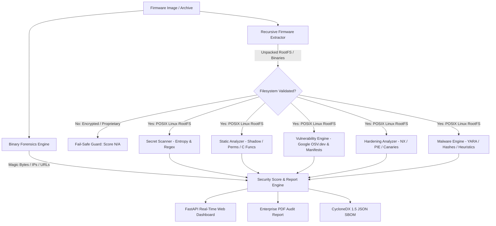

# 🛡️ IoT Firmware Security Scanner (v1.2)

[](https://github.com/chinmayiM-bhise/Embedded-Device-Security-Assessment/actions/workflows/ci.yml)
[](https://www.python.org/)
[](https://cyclonedx.org/)
[](https://www.docker.com/)
[](https://opensource.org/licenses/MIT)

> An automated, production-grade security auditing platform for embedded IoT device firmware images and binaries. Discovers hardcoded secrets, computes Shannon entropy, performs real-time CVE correlation via Google OSV.dev, audits binary compiler mitigations, detects malware botnets via YARA, and exports compliance-ready **CycloneDX 1.5 SBOMs** and **Enterprise PDF Audit Reports**.

---

## ⚡ 1-Click Cloud Launch

Launch and audit firmware directly in your browser without installing anything locally:

[](https://codespaces.new/chinmayiM-bhise/Embedded-Device-Security-Assessment)

---

## 🏛️ System Architecture



---

## ✨ Key Capabilities

| Engine | Module | Description |
| :--- | :--- | :--- |
| **Recursive Unpacker** | [`extractor.py`](file:///D:/Github%20projects/IOT%20Firmware%20assesment/iot_scanner/core/extractor.py) | Recursively unpacks nested archives (`.zip` containing `.bin` images) up to depth 3 with Linux rootfs validation. |
| **Real-Time CVE Intelligence** | [`cve_client.py`](file:///D:/Github%20projects/IOT%20Firmware%20assesment/iot_scanner/core/cve_client.py) | Queries **Google OSV.dev API** for live package CVEs with offline SQLite caching (`cve_cache.db`). |
| **Software Bill of Materials** | [`sbom_generator.py`](file:///D:/Github%20projects/IOT%20Firmware%20assesment/iot_scanner/core/sbom_generator.py) | Generates **CycloneDX 1.5 JSON SBOM** for EU Cyber Resilience Act & US Executive Order 14028 compliance. |
| **Package Manifest Parser** | [`vulnerability_scanner.py`](file:///D:/Github%20projects/IOT%20Firmware%20assesment/iot_scanner/core/vulnerability_scanner.py) | Parses **OPKG** (OpenWrt) and **DPKG** (Debian/Ubuntu IoT) status files for 100% accurate package inventory. |
| **Binary Hardening** | [`hardening_analyzer.py`](file:///D:/Github%20projects/IOT%20Firmware%20assesment/iot_scanner/core/hardening_analyzer.py) | Inspects ELF headers via `pyelftools` for NX / DEP, PIE, Stack Canaries (`__stack_chk_fail`), and RELRO. |
| **Secret & Key Hunter** | [`secret_scanner.py`](file:///D:/Github%20projects/IOT%20Firmware%20assesment/iot_scanner/core/secret_scanner.py) | Calculates **Shannon Entropy** (`> 4.8`) and regex pattern matching to uncover API keys and SSH private keys. |
| **Malware & Botnet Engine** | [`malware_scanner.py`](file:///D:/Github%20projects/IOT%20Firmware%20assesment/iot_scanner/core/malware_scanner.py) | Multi-vector detection using bundled YARA rules (Mirai, Gafgyt, Hajime), cryptographic hashes, and writable path heuristics. |
| **Fail-Safe Scoring Guard** | [`report_generator.py`](file:///D:/Github%20projects/IOT%20Firmware%20assesment/iot_scanner/core/report_generator.py) | Accurately reports `Score: N/A` for encrypted/unparseable images instead of false 100/100 scores. |

---

## 🚀 Quickstart Guide

### Option 1: Run with Docker (Zero Setup - Recommended)

```bash
# Clone the repository
git clone https://github.com/chinmayiM-bhise/Embedded-Device-Security-Assessment.git
cd Embedded-Device-Security-Assessment

# Start with Docker Compose
docker compose up --build
```
Open **[http://localhost:8000](http://localhost:8000)** in your browser.

---

### Option 2: Local Python Execution

#### 1. Prerequisites (Ubuntu / WSL)
```bash
sudo apt update && sudo apt install -y binwalk yara libmagic1 squashfs-tools
```

#### 2. Install & Run
```bash
# Create and activate virtual environment
python3 -m venv venv
source venv/bin/activate  # On Windows: .\venv\Scripts\activate

# Install dependencies
pip install -r requirements.txt

# Start Web Server
python -m iot_scanner.web.api
```
Open **[http://localhost:8000](http://localhost:8000)** in your browser.

---

## 💻 Enterprise CLI Usage

For headless automation or CI/CD pipelines:

```bash
# Run a full security audit on a firmware image
python -m iot_scanner.cli.main scan path/to/firmware.zip -o output_dir
```

### Generated Audit Artifacts:
- `output_dir/audit_report.pdf` — Publication-ready executive security report.
- `output_dir/sbom_cyclonedx.json` — CycloneDX 1.5 compliant Software Bill of Materials.
- `output_dir/results.json` — Machine-readable structured findings.

---

## 🔍 Real-World Compatibility Matrix

| Firmware Category | Status | Notes |
| :--- | :---: | :--- |
| **OpenWrt / Linux-based `.bin` / `.img`** | ✅ Supported | Full package inventory via OPKG, CVEs, and hardening analysis. |
| **Vulnerable Testbeds (IoTGoat, DVRF)** | ✅ Supported | Tested for full credential, malware, and static vulnerability detection. |
| **Nested `.zip` / `.tar.gz` archives** | ✅ Supported | Recursively unpacks inner `.bin` images up to depth 3. |
| **Standalone ARM/MIPS/x86 ELF Binaries** | ✅ Supported | Full binary hardening verification (NX, PIE, Canaries, RELRO). |
| **Encrypted Vendor Firmware (TP-Link Deco, Netgear Armor)** | ⚠️ Protected | Detected via fail-safe guard; returns `Score: N/A` + encryption notice. |
| **Bare-metal RTOS (FreeRTOS, ESP32 raw ROMs)** | ⚠️ Forensics Only | Scans binary strings & entropy; POSIX paths are not present. |

---

## 🧪 Running Automated Tests

```bash
pytest -v
```

---

## 📜 License

Distributed under the **MIT License**. See `LICENSE` for more information.
